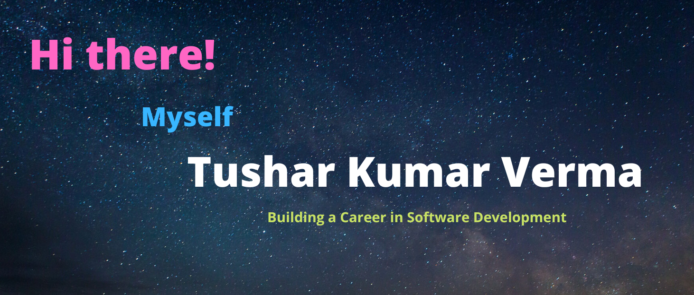

<link rel="stylesheet" href="https://stackpath.bootstrapcdn.com/bootstrap/4.3.1/css/bootstrap.min.css">

  

### 
I'm Tushar, a full-stack developer 👨‍💻 working remotely since 20 🚀
  
  

- 🔭 I’m a tech lover, I do Full-Stack Web Development & Software Development.  
  

- 🌱  I’m currently learning Competitive Programming 
  
   

#
 
 
<table>
  <tr>
    <th>
      

  

 

 

 

   

      
      
      
      
      
      
   </th>
  </tr>
</table>  

   

#
 
 
<table align="center">
    <tr>
        <th width="50%" height="60%" >
            
        </th>
        <th width="50%" height="400px" >
            
        </th>
    </tr>
</table>
 

#
 
 

  

   
 

#

